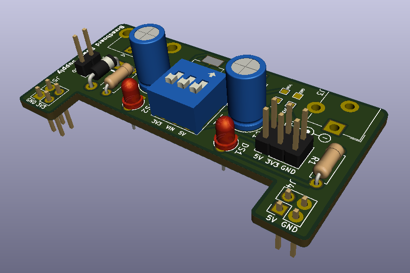
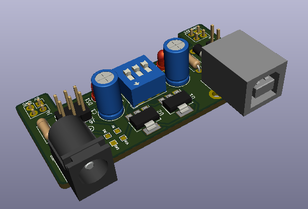

# Breadboard Power Supply

A convenient power supply to provide power while building and testing analog/digital circuits on a breadboard

## Features
* Snaps right onto a breadboard
* Input power can be derived a 12V SMPS via barrel jack or 5V via USB cable
* Switches to switch the output voltages on/off

## Technical specs
* *Output voltages:* 5V and 3.3V
* *Output currents:* 1A max for each voltage when connected to a 12V 2A SMPS and 500 mA total when connected to USB

**Caution:**Do not connect current hungry components when input power is provided via USB 

## Simulated PCB View

## Future development
* Adding a XR2206 or equivalent to generate signals
* Adding a STM32 or equivalent to sample signals and plot waveforms on the serial monitor

### Made with lots of ⏱️, 📚 and ☕ by [InputBlackBoxOutput](https://github.com/InputBlackBoxOutput/)
