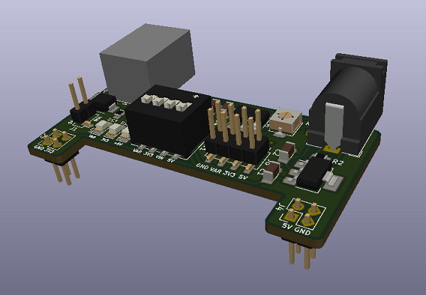
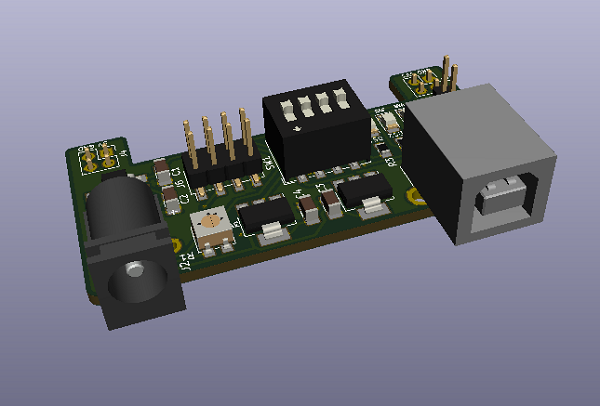
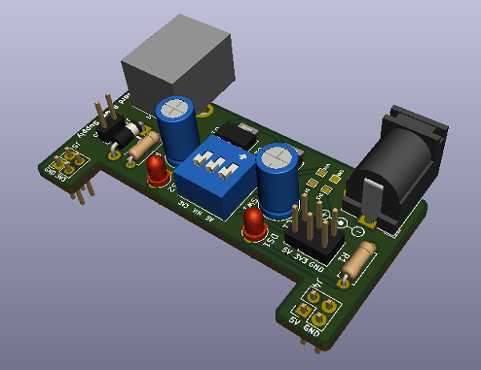

# Breadboard Power Supply

A convenient power supply to provide power while building and testing analog/digital circuits on a breadboard

## Features
* Snaps right onto a breadboard
* Input power can be derived from a 12V SMPS via barrel jack or 5V via USB cable
* Switches to switch the output voltages on/off 
* Provides variable voltage 

## Technical specs
* *Output voltages:* Fixed: 5 ± 0.150V and 3.3 ± 0.099V and Variable: 1.25V to ≈Vsupply 
* *Output currents:* 1.1A max for each voltage when connected to a 12V 2A SMPS and 500 mA total when connected to USB

### Caution: Do not connect current hungry components when input power is provided via USB 

## 3D Render

### Variant using mostly through-hole components
This variant does not have variable voltage supply.

[Link to the PCB design files](https://github.com/InputBlackBoxOutput/Breadboard-Power-Supply/tree/60b90112e1da0e54daea845532b61c8a3cf01776)

### Made with lots of ⏱️, 📚 and ☕ by [InputBlackBoxOutput](https://github.com/InputBlackBoxOutput/)
